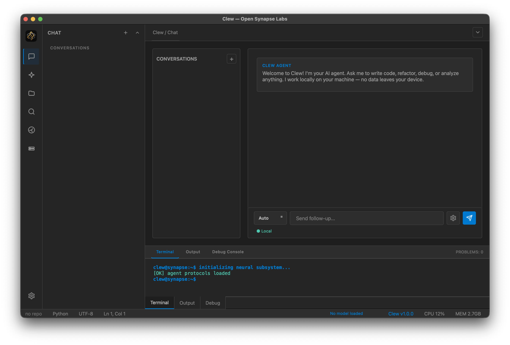
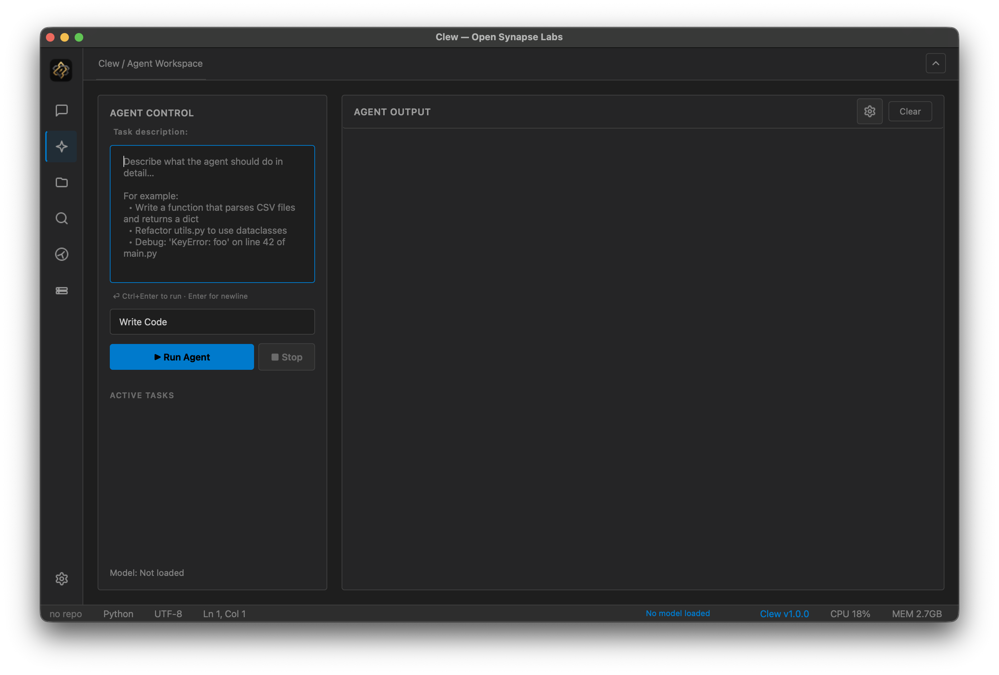
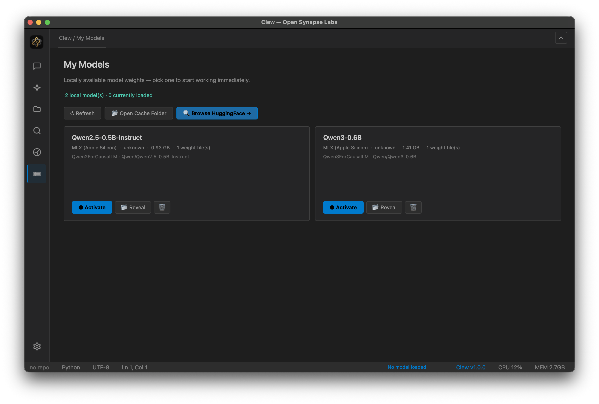
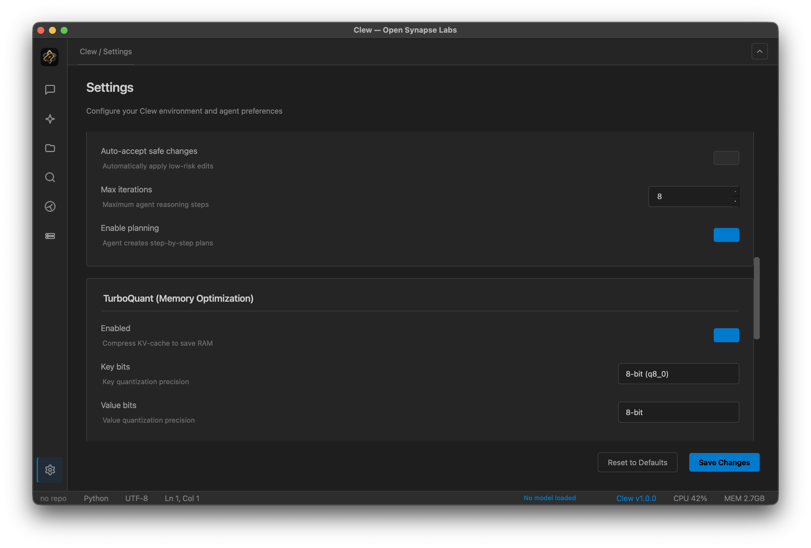

<div align="center">

# Clew

**A native, local-first AI IDE for macOS Apple Silicon.**
The privacy-first alternative to Cursor — with a built-in model manager. Just download the `.dmg` and go.

[-lightgrey.svg)]()
[-blue.svg)]()
[](LICENSE)
[](https://github.com/OpenSynapseLabs/Clew/releases)
[](#)

**[Download v1.0.0-beta (.dmg)](https://github.com/OpenSynapseLabs/Clew/releases)** (coming soon)

</div>

---

> **Clew = Cursor + LM Studio, wrapped in a single .dmg, running 100% on your laptop.** 🚀
> No Python dependencies to install. No API keys. No subscriptions. No telemetry. 
> Your codebase never leaves your machine.

## 🌟 Why Clew?

Two tools dominate the AI developer workflow today, but both force you to compromise. Clew closes the gap.

| Tool | What it gives you | What it doesn't |
|:---:|:---|:---|
| **Cursor** | Polished editor with deeply integrated AI. | Cloud-only inference. Privacy concerns. $20/mo subscription. |
| **LM Studio** | Great GUI for downloading and running local models. | No editor. No agent. You still need a separate IDE to actually code. |

**Clew ships everything in one native macOS app:**
- 🧠 **Agent Runtime:** Autonomous task execution (plan, read, write, run).
- 💾 **Model Manager:** Browse Hugging Face, download, and hot-swap local models with one click.
- 📝 **Code Editor:** Multi-tab editing, syntax highlighting, and built-in terminal.
- 🔒 **Absolute Privacy:** Everything runs locally. Zero network calls by default.

---

## 🖼️ Visual Tour

A modern, dark-themed UI built natively for macOS. No Electron, no web wrappers — pure performance on Apple Silicon.

| | |
|:---:|:---:|
|  |  |
| **Chat View** — Natural conversation with your local agent. | **Agent Workspace** — Define tasks and execute code autonomously. |
|  |  |
| **Model Manager** — Browse Hugging Face & manage local LLMs. | **Settings** — Configure memory optimization & agent behavior. |

---

## 🧠 Supported Models

Clew works with any open-source model available on Hugging Face in **GGUF** or **MLX** formats. No vendor lock-in.

**Recommended Models for Apple Silicon:**
*   **Llama 3.1 / 3.2** (Meta) — Excellent general-purpose coding and reasoning.
*   **Mistral / Mixtral** (Mistral AI) — Fast, efficient, great at following instructions.
*   **Qwen 2.5** (Alibaba) — Outstanding performance per parameter size.
*   **Phi-3 / Phi-3.5** (Microsoft) — Incredible speed and logic for small sizes.
*   **Gemma 2** (Google) — Strong reasoning capabilities.

*You can download and switch between any of these directly from the "My Models" tab inside the app.*

---

## 🚀 Installation

### Requirements
- **macOS 13+** on **Apple Silicon (M1, M2, M3, M4, M5)**.
- ~4 GB of free RAM for small models (e.g., Qwen 0.5B), ~8-10 GB for standard 7B-8B models.

### The Easy Way (Recommended)

No need to install Python, pip, or any dependencies. We provide a pre-built universal application.

1. Go to the [Releases](https://github.com/OpenSynapseLabs/Clew/releases) page.
2. Download the latest `Clew-vX.X.X-arm64.dmg`. (coming soon)
3. Double-click to mount, drag **Clew** to **Applications**.
4. On first launch: Right-click → **Open** → **Open anyway** (to bypass Gatekeeper).
5. Open **My Models** → **Browse Models** → Download a model (e.g., Llama 3.2 3B) → Click **Activate**.

### From Source (For Developers)

If you want to hack on Clew or run it directly from the command line:

```bash
git clone https://github.com/OpenSynapseLabs/Clew.git
cd Clew
python3 -m venv .venv
source .venv/bin/activate
pip install e .
clew
```

---

## 🏁 Quick Start

1. **Open a Folder:** `File → Open Folder…` (⌘O). Clew indexes your codebase in the background.
2. **Load a Model:** Go to **My Models** → **Browse Models**. Pick a model that fits your RAM and download it.
3. **Chat:** Switch to the **Chat** view. Ask questions about your code, request refactors, or generate boilerplate.
4. **Run Agent:** Switch to the **Agent** view. Describe a task (e.g., *"Add a REST API endpoint to app.py and write tests for it"*) and click **Run Agent**. Watch it plan and execute.

---

## ✨ Key Features

<details>
<summary><strong>🧩 Native Editor & IDE</strong></summary>

- Multi-tab code editor with syntax highlighting, line numbers, and find/replace.
- Built-in terminal panel for running scripts and commands without leaving the app.
- Native macOS integration: custom menus, dark-mode-aware palette, high-DPI support.
- Project-wide search to instantly find functions and variables across your codebase.

</details>

<details>
<summary><strong>🤖 Autonomous Agent Runtime</strong></summary>

- ReAct-style loop: The AI thinks, plans, calls tools, and observes results.
- Sandboxed tool execution: Commands run securely without risking your system.
- Live UI trace: Watch the agent's thoughts, file reads, and code writes in real-time.

</details>

<details>
<summary><strong>⚡ Performance & Memory Optimization</strong></summary>

- **TurboQuant Engine:** Pure-NumPy KV-cache compression to significantly reduce RAM usage while maintaining model quality.
- Native Apple Silicon optimization: Leverages Metal and MLX where available for blazing fast inference.

</details>

---

## 🗺️ Roadmap

We are actively developing Clew. Here is what to expect next:

- **v1.0.0-beta (Current):** Core editor, agent runtime, model manager, chat interface.
- **v1.0.1 (Next):** 
  - Stabilization and bug fixes based on community feedback.
  - UI/UX polish (better typography, spacing, and visual hierarchy).
  - Core function refinements and smoother streaming.
- **v1.1.0:** Auto-updater (Sparkle integration), inline "Apply" buttons in chat for easy diffing.
- **v1.2.0:** Git integration (branch status, diff viewer, commit UI).
- **Future:** Advanced debugging, plugin system, Windows/Linux ports.

- **v1.0.1 (Next):**
  - New unified AI workspace.
  - Natural-language task composer.
  - Templates & Skills system.
  - Improved onboarding experience.
  - Major UI redesign and navigation improvements.
  - Smoother streaming and stability fixes.

### 👀 v1.0.1 Preview

> 🚧 Work in progress. The interface shown below is from a preview build and may change before release.

<p align="center">
  
</p>

**What's new:**

- ✨ New centralized workspace.
- 🧠 Describe tasks in natural language.
- 🏗️ Template-driven workflows.
- 🛠️ Reusable Skills system.
- 🚀 Faster onboarding for new users.
- 🎯 Cleaner visual hierarchy and navigation.

---

## 📬 Contact & Support

- **Email:** [opensynapselabs@proton.me](mailto:opensynapselabs@proton.me)
- **Issues:** [GitHub Issue Tracker](https://github.com/OpenSynapseLabs/Clew/issues)

---

## 📄 License

Apache License 2.0 — see [LICENSE](LICENSE).

Built with care by **Open Synapse Labs**.

---

<div align="center">

**[Download Latest Release](https://github.com/OpenSynapseLabs/Clew/releases)** ·
**[Report a Bug](https://github.com/OpenSynapseLabs/Clew/issues)**

</div>
