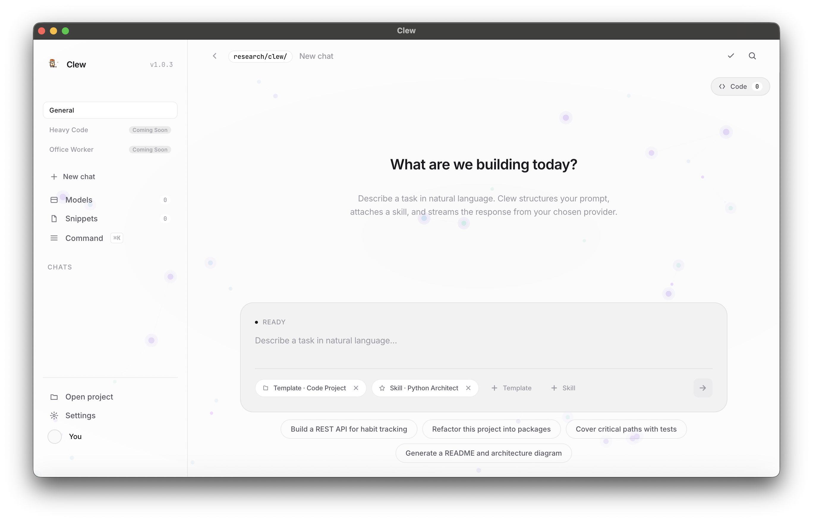
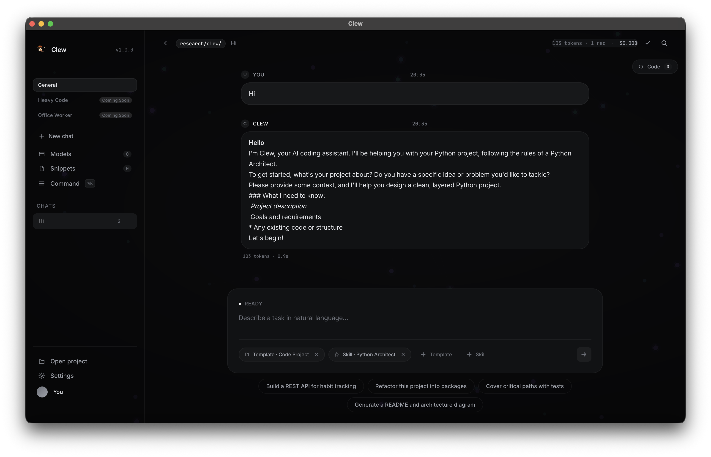
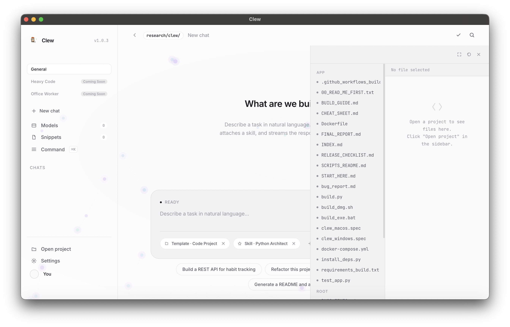
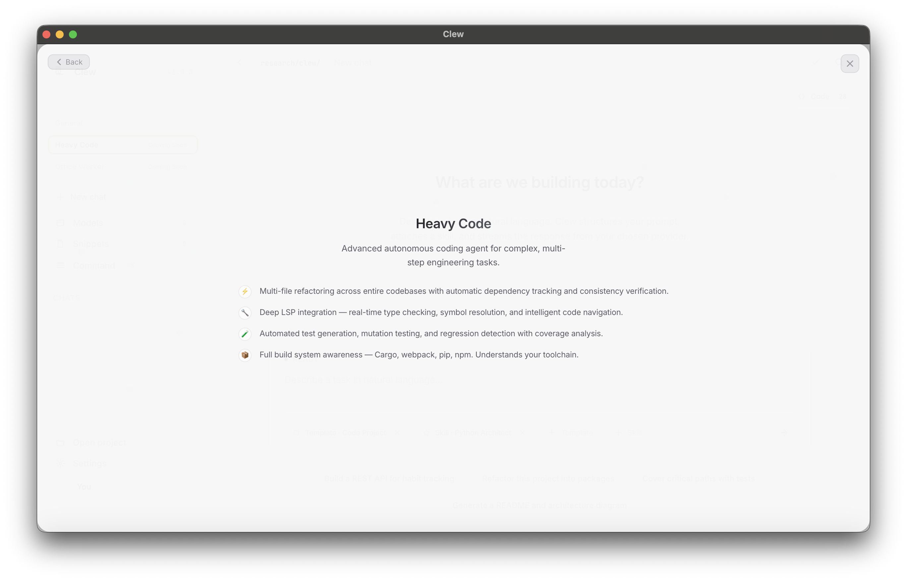
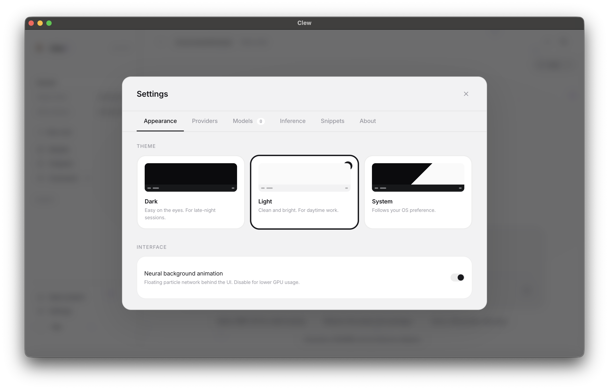
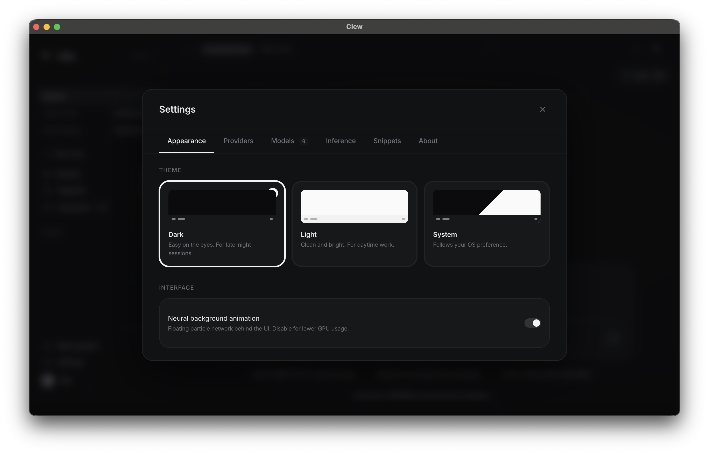
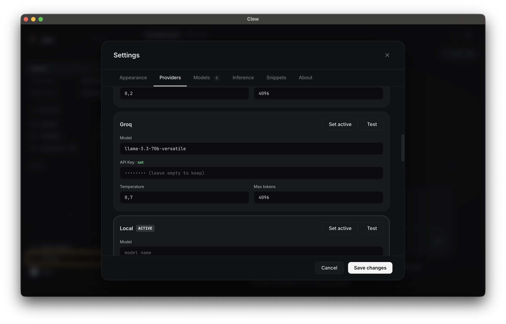
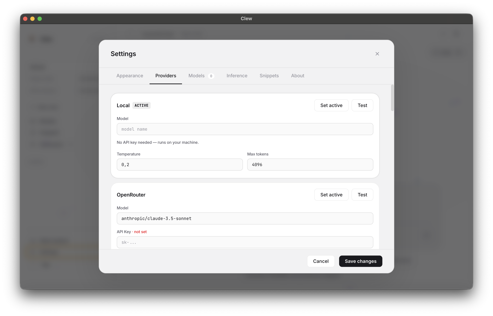
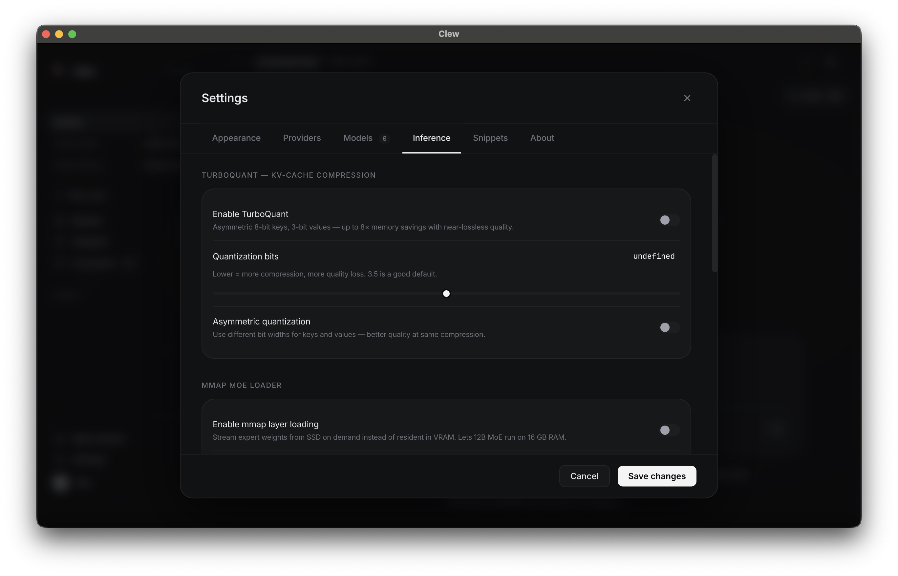
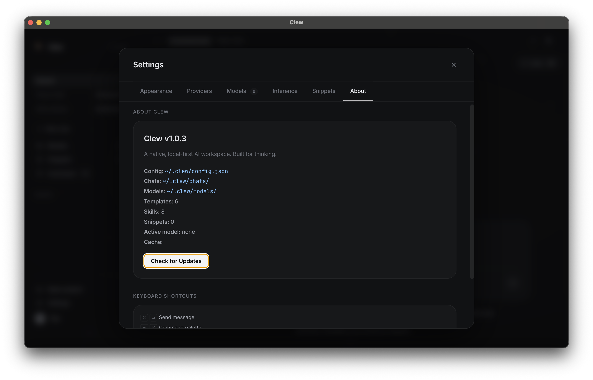

<div align="center">

# Clew

**The next-generation free AI coding tool for everyone.**
A cross-platform AI IDE where anyone can bring their project to life with AI agents. Built-in local model manager, multi-provider API support, and a stunning interface.

[]()
[](LICENSE)
[](#)

**[Download Latest Release](https://github.com/ilyaosovskoi/Clew/releases)**

</div>

---

> **Clew = Cursor + LM Studio + Multi-API Gateway, all in one app.** 🚀
> No Python dependencies. No telemetry. Absolute privacy for local models, with the flexibility to plug in cloud APIs. 
> Your workflow, supercharged by AI.

## 🌟 Why Clew?

Most AI IDEs force you to choose between local privacy and cloud capabilities. Clew bridges the gap with a unified, premium experience built for everyone.

**Clew ships everything in one app:**
- 🧠 **Multi-Provider Inference:** Seamlessly switch between local models (GGUF/MLX) and cloud APIs (Anthropic, z.ai, and many others).
- 🛰️ **Built-in API Gateway:** Clew runs a local server that efficiently handles and routes API requests for maximum speed.
- 📂 **Integrated Code Viewer:** Select a project directory and instantly read any file without leaving the app.
- ✨ **Premium UI/UX:** A polished interface with light, dark, and system themes, complete with ambient neural synapse effects.
- 🔒 **Absolute Privacy:** Everything local runs entirely on your machine. Zero outbound calls unless you explicitly use a cloud API.

---

## 🖼️ Visual Tour

| | |
|:---:|:---:|
|  |  |
|  |  |
|  |  |
|  |  |
|  |  |

---

## 🧠 Models & APIs

Clew gives you ultimate freedom in choosing your inference engine. 

**Local Models (GGUF / MLX):**
Works with any open-source model on Hugging Face. 
*   **Llama 3.1 / 3.2** (Meta) — Excellent general-purpose coding and reasoning.
*   **Mistral / Mixtral** (Mistral AI) — Fast, efficient, great at following instructions.
*   **Qwen 2.5** (Alibaba) — Outstanding performance per parameter size.
*   **Phi-3 / Phi-3.5** (Microsoft) — Incredible speed and logic for small sizes.

**Cloud APIs:**
Don't want to run models locally? Bring your own API keys. Clew natively supports:
*   **Anthropic** (Claude family)
*   **z.ai** and other major providers.
*   *All routed through Clew's high-speed internal API server for minimal latency.*

---

## 🚀 Installation

### Requirements
- **Supported platforms:** macOS, Windows, Linux
- For local models: ~4 GB free RAM for small models, ~8-10 GB for standard 7B-8B models.

### The Easy Way (Recommended)

Clew comes with a built-in auto-updater. You only need to install it once!

1. Go to the [Releases](https://github.com/ilyaosovskoi/Clew/releases) page.
2. Download the latest version for your platform.
3. Install the application.
4. Open **Settings** → Choose your theme, configure your API keys or download a local model.

### From Source (For Developers)

```bash
git clone https://github.com/OpenSynapseLabs/Clew.git
cd Clew
python3 -m venv .venv
source .venv/bin/activate
pip install -e .
clew
```

---

## 🏁 Quick Start

1. **Open a Project:** `File → Open Folder…`. Clew indexes your codebase, and the **Code Viewer** opens on the right, letting you read any file instantly.
2. **Configure Inference:** Go to **Settings**. Add an API key (e.g., Anthropic) or go to **My Models** to download a local one.
3. **Pick a Template:** In the main workspace, choose a prompt template (e.g., *Code Project*), select a Skill, and describe your task.
4. **Run Agent:** Watch Clew plan, read, write, and execute code autonomously. Live token counting keeps you informed of context usage.

---

## ✨ Key Features

<details>
<summary><strong>🎨 Premium UI & Customization</strong></summary>

- **Theme Engine:** Switch between Light, Dark, and System themes.
- **Ambient Synapse Effects:** Beautiful background animations mimicking neural pathways. Can be toggled off in settings for a distraction-free environment.
- **Integrated Code Viewer:** A powerful right-panel viewer that lets you read and explore your entire project directory without opening external editors.
- Native OS integration: custom menus, high-DPI support, and flawless typography.

</details>

<details>
<summary><strong>🧩 Unified Workspace & Templates</strong></summary>

- **Natural Language Task Composer:** Describe what you want to build in plain English.
- **Prompt Templates:** Pre-configured templates for rapid task initiation. Just insert your specific words and go.
- **Agent Skills:** Reusable context profiles to guide the agent's behavior.

</details>

<details>
<summary><strong>⚙️ Advanced Inference & API Gateway</strong></summary>

- **Multi-Provider Support:** Switch between local LLMs and cloud APIs (Anthropic, z.ai, etc.) on the fly.
- **Local API Server:** Clew spins up a lightweight local server to handle API requests and routing, ensuring maximum speed and streaming performance.
- **Detailed Local Settings:** Fine-tune local model parameters (threads, context size, GPU layers) directly in the app.
- **Live Token Counting:** Accurate, real-time tracking of token usage during agent runs and chats.

</details>

<details>
<summary><strong>🤖 Autonomous Agent Runtime</strong></summary>

- ReAct-style loop: The AI thinks, plans, calls tools, and observes results.
- Sandboxed tool execution: Commands run securely without risking your system.
- Live UI trace: Watch the agent's thoughts, file reads, and code writes in real-time.

</details>

---

## 🗺️ Roadmap

We are actively developing Clew. Here is what to expect in upcoming releases:

- **Expanded Templates & Skills:** Introducing specialized modes like *Office Worker* for document tasks and *Heavy Code* for deep, complex repository refactoring.
- **Git Integration:** Branch status, diff viewer, and commit UI.
- **Advanced Debugging:** Deep introspection of agent runs and variable states.
- **Plugin System:** Allow the community to build and share their own tools.
- **Enhanced Cross-Platform:** Further optimizations for Windows and Linux.

---

## 📬 Contact & Support

- **Issues:** [GitHub Issue Tracker](https://github.com/OpenSynapseLabs/Clew/issues)

---

## 📄 License

Apache License 2.0 — see [LICENSE](LICENSE).

---

<div align="center">

**[Download Latest Release](https://github.com/OpenSynapseLabs/Clew/releases)** ·
**[Report a Bug](https://github.com/OpenSynapseLabs/Clew/issues)**

</div>
